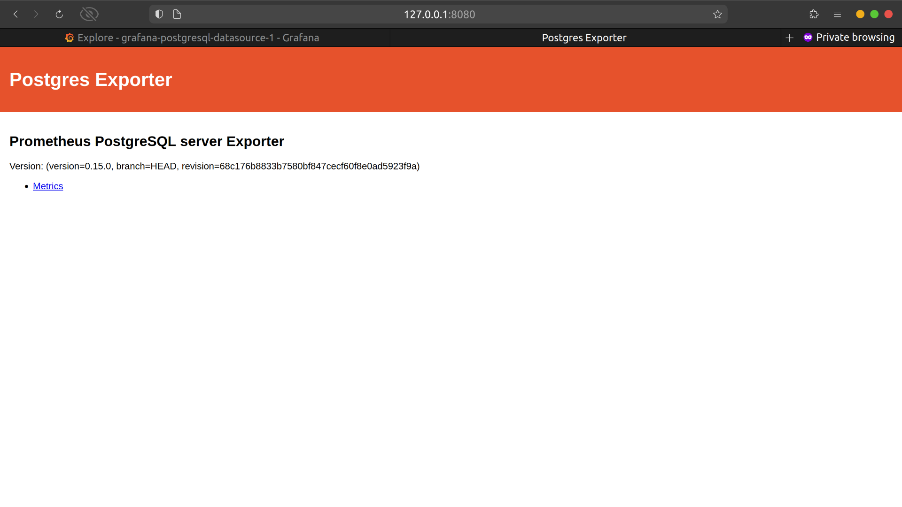

---

# Kubernetes-Postgres-Persistence-And-Monitoring-with-Prometheus-and-Grafanas

## Objective:
Expand the existing Kubernetes cluster that I created in Kubernetes-Dynamic-Scaling-with-HPA-and-Load-Testing to complete this Project. Add PostgreSQL to the cluster. Also add Prometheus and Grafana to monitor PostgreSQL and ensure data persistence for all of them that will prevent data loss during crashes/restarts.

## Steps:

## 1. Installing Helm

Install Helm on your local machine by running the following commands:

```bash
curl -fsSL -o get_helm.sh https://raw.githubusercontent.com/helm/helm/main/scripts/get-helm-3
chmod 700 get_helm.sh
./get_helm.sh
```


## 2. Install Kube-Prometheus-Stack on cluster

This will install the kube-prometheus stack, a collection of Kubernetes manifests, Grafana dashboards, and Prometheus rules combined with documentation and scripts to provide easy to operate end-to-end Kubernetes cluster monitoring with Prometheus using the Prometheus Operator.

### Steps:

## 2.1. Add Prometheus community Helm repository:
```bash
helm repo add prometheus-community https://prometheus-community.github.io/helm-charts
helm repo update
```


## 2.2. Install Grafana and Prometheus:
```bash
helm upgrade --install grafana prometheus-community/kube-prometheus-stack
```


## 3. Install PostgreSQL database on cluster

### Steps:

## 3.1. Add Bitnami Helm repository:
```bash
helm repo add bitnami https://charts.bitnami.com/bitnami
```


## 3.2. Install PostgreSQL using Helm:
```bash
helm install postgresql-dev bitnami/postgresql
```


## 3.4. Access PostgreSQL and set password:
```bash
kubectl exec -it pod/postgresql-dev-0 sh
echo OTYwV0FRemZHZA== | base64 -d
POSTGRES_PASSWORD="Zuq6ldS8SS"
PGPASSWORD="$POSTGRES_PASSWORD" psql --host 10.111.34.136 -U postgres -d postgres -p 5432
```


## 3.5. Create a database and table:
```sql
CREATE DATABASE testdb;
PGPASSWORD="$POSTGRES_PASSWORD" psql --host 10.111.34.136 -U postgres -d testdb -p 5432
CREATE TABLE hello_world (region text, country text, year int, production int, consumption int);
INSERT INTO hello_world (region, country, year, production, consumption) VALUES ('America', 'USA', 1998, 2014, 12897);
```


## Port forward to access exporter:
```bash
kubectl port-forward service/grafana 3000:80
```


## Change PostgreSQL spec type from ClusterIp to LoadBalancer:


## 4. Install Prometheus Postgres Exporter

### Steps:

## 4.1. Add Prometheus community Helm repository:
```bash
helm repo add prometheus-community https://prometheus-community.github.io/helm-charts
helm repo update
```


## 4.2. Install Prometheus Postgres Exporter:
- Create postgress-exporter-values.yaml
```yaml
config:
  ## The datasource properties on config are passed through helm tpl function.
  ## ref: https://helm.sh/docs/developing_charts/#using-the-tpl-function
  datasource:
    # Specify one of both datasource or datasourceSecret
    host: "10.1.149.240"
    user: postgres
    password: Zuq6ldS8SS

serviceMonitor:
  # When set true then use a ServiceMonitor to configure scraping
  enabled: true
  labels:
    release: grafana    
```yaml

```bash
helm upgrade --install postgres-exporter prometheus-community/prometheus-postgres-exporter -f postgress-exporter-values.yaml
```


## 4.3. Port forward to access exporter:
```bash
kubectl port-forward svc/postgres-exporter-prometheus-postgres-exporter 8080:80
```




## 5. Install Prometheus Postgresql Exporter Dashboard

### Steps:

## 5.1. Access Grafana dashboard and add PostgreSQL exporter dashboard ID: 12485


## 6.  Install MetalLB

#### Steps:

## 6.1. Install MetalLB using single-line manifest installation:
```bash
kubectl apply -f https://raw.githubusercontent.com/metallb/metallb/v0.14.5/config/manifests/metallb-native.yaml
```


## 6.2. Create ipaddresses.yml file:

```yaml
apiVersion: metallb.io/v1beta1 
kind: IPAddressPool 
metadata: 
  name: first-pool 
  namespace: metallb-system 
spec: 
  addresses: 
  - 10.1.149.240-10.1.149.250
```

## 6.3. Create layer2.yml file:
```yaml
apiVersion: metallb.io/v1beta1 
kind: L2Advertisement 
metadata: 
  name: first-pool 
  namespace: metallb-system
```

## 6.4. Apply both files to Kubernetes cluster:
```bash
kubectl create -f ipaddresses.yml
kubectl create -f layer2.yml
```


## 6.5. External Ip Assigned:


## 7. Implemented data persistence using PersistentVolumeClaims:


## 8. Deleting PostgreSQL pod:
```bash
kubectl delete pod postgresql-dev-0 --grace-period=0
```
## 9. Alert and Screen Cast
### Step 1: Setting up Alert.
  


### Step 2: Record Screencast

[Execution-Watch the Screencast](https://www.dropbox.com/scl/fi/by5j3qncl3n9r969md5zn/Screencast-from-30-04-24-03-44-45-AM-IST.webm?rlkey=nneju92mb6ecqpswrq38ul1xm&st=u1bealjy&dl=0)

[Setup&Testing-Watch the Screencast](https://www.dropbox.com/scl/fi/45suwapa8q48kc3wcwwfq/Screencast-from-30-04-24-01-58-42-AM-IST.webm?rlkey=c0qurwt1rqj0omyvl4ee14ope&st=5ypbnoi9&dl=0)


---

This README provides detailed instructions for setting up PostgreSQL, Grafana, and Prometheus within the Kubernetes cluster, along with configuring monitoring dashboards and alerts. Additionally, it includes steps for installing MetalLB, implementing data persistence, and testing the setup.
